# 🌍 Global CO₂ Emissions Analysis & Forecasting – Data Science Machine Learning Project

A data science project exploring previous CO₂ emissions for major countries, analysing long-term trends, comparing percentage changes over decades, and forecasting future emissions using Exponential Smoothing and Prophet models.

---

## 📦 Dataset Overview

The dataset contains **annual CO₂ emissions** for countries across multiple decades, with the following key columns:

* `Entity`: Country name
* `Year`: Year of measurement
* `Annual_CO2_emissions`: CO₂ emissions for that year (tonnes)

For this project, six major emitters were selected for detailed analysis:
**United States, China, India, Iran, Brazil, United Kingdom**

---

## ✅ Project Workflow

1. **Data Preparation**

   * Loaded the CO₂ dataset and renamed columns for consistency
   * Filtered the dataset to focus on six selected countries
   * Removed missing or zero emission values for accurate trend analysis

2. **Exploratory Data Analysis (EDA)**

   * Plotting CO₂ emissions from 1990 to 2023
   * Comparing historical patterns across different countries
   * Identifying long-term rising or declining emission trends

A multi-line plot was created to visualise emission trajectories for all selected countries over time.

3. **Percentage Change Analysis**

To evaluate long-term progress (or regression), the project:

   * Extracted emission values for 1990 and 2023
   * Calculated % change from 1990 to 2023
   * Sorted countries by greatest increase or decrease
   * Visualised the results using a bar chart

This allows quick identification of which countries have reduced emissions and which have sharply increased over the last three decades.

4. **Forecasting With Exponential Smoothing**

For each selected country:

 * Historical data from 2000 onwards was extracted
 * A Exponential Smoothing model was trained
 * Forecasts were generated up to 2030
 * Actual vs. predicted time-series plots were created

This model offers a simple but effective view of short-term and medium-term emission patterns.

5. **Forecasting With Prophet**

Using Meta’s Prophet library:

 * CO₂ emissions were reformatted into Prophet-compatible format
 * Models were trained per country with tuned changepoint_prior_scale
 * Future dataframes were created up to 2030
 * Forecast curves (yhat) were plotted against actual values

Prophet captures nonlinear trends and structural breaks, making it useful for countries with fluctuating emission patterns.

---

## 🔍 Key Observations

1. Long-Term Emission Trends

The selected countries display markedly different long-term emission trajectories:

 * **China** shows the highest emissions among all countries in the dataset and continues to rise. This sustained increase is largely driven by rapid industrial expansion, heavy dependence on coal, large-scale manufacturing output, and continued economic growth.

 * **India** is also on an upward trajectory. Similar to China, India’s rise can be attributed to economic development, increasing energy demands, population growth, and expanding industrial activity.

 * The **United States** demonstrates a clear long-term decline in emissions. This downward trend is likely the result of cleaner energy policies, the shift from coal to natural gas, improvements in energy efficiency, and increased investment in renewable technologies.

 * **Iran, Brazil, and the United Kingdom** appear relatively stable or modest in comparison. Their trends may seem flat largely because the overall graph is dominated by China’s significantly higher values, compressing the visual scale. In reality:
    * Iran shows gradual growth.
    * Brazil fluctuates with slight upward movement.
    * The United Kingdom exhibits long-term reductions due to strong decarbonisation policies and the decline of coal usage.

2. Percentage Change

The percentage change analysis reveals a different perspective from the raw emission totals:

 * **India** records the highest percentage increase, around 420% over the last 30 years. While India’s total emissions are lower than China’s, the rate of increase is more dramatic due to rapid industrialisation, population growth, and rising energy consumption from a relatively low baseline.

 * **China** follows closely with approximately 380% growth. Although China’s absolute emissions are the largest, its percentage increase is slightly lower because its industrial rise began earlier and from a higher starting point.

 * **The United Kingdom and the United States** show negative percentage change, meaning their emissions have declined compared with 1990. This reduction is likely due to:
    * Adoption of renewable energy sources
    * Improvements in energy efficiency
    * Closure of coal-fired plants
    * Stronger environmental regulations and climate commitments

These contrasting trends highlight the different stages of economic development and climate policy implementation across the selected countries.

3. Forecasting Observations

Forecasts generated using Exponential Smoothing and Prophet suggest the following:
 * **China**: Forecasts continue to rise, reflecting ongoing industrial activity and sustained energy demand.
 * **India**: Also projected to increase further, consistent with strong population and economic growth.
 * **Iran**: Emissions are expected to rise modestly.
 * **Brazil**: Forecasts show slight increases, though not as steep as other developing nations.
 * **United States**: Predicted to continue its downward trajectory.
 * **United Kingdom**: Forecasts also point towards continued reductions.

Limitations of Forecasts
Some forecast lines appear overly straight or trend sharply towards zero, which is unlikely in real-world scenarios. This occurs due to:
 * Limited data points for some countries
 * Simplified model assumptions
 * Absence of seasonal or policy-driven variations
 * Models extrapolating linear patterns in situations where emissions are influenced by complex geographical and economic factors

As a result, the forecasts should be interpreted as broad directional indicators rather than precise future values.

---

## 📊 Visual Insights

Here are some of the key visualisations from the analysis:

### 1. CO₂ Emissions Over Time

* Line chart comparing emissions for all selected countries.

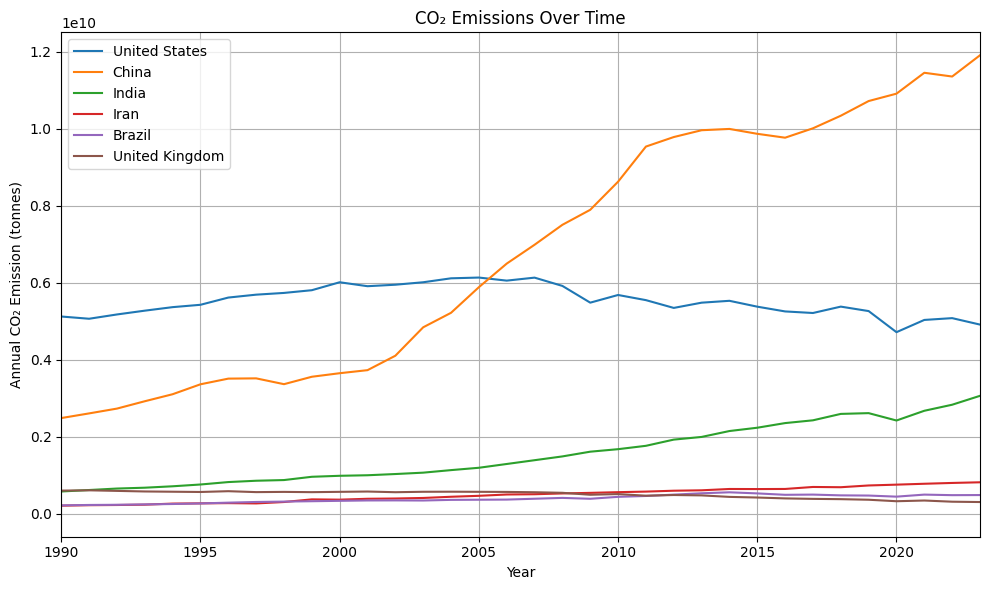

---

### 2. Emissions Percentage Change 

* Bar chart showing long-term emission increases or reductions.

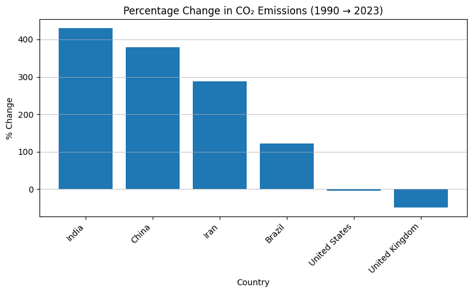

---

### 3. Exponential Smoothing vs Prophet Forecasting per Country

* Forecasts per country with actual + predicted values.

---
**United States**

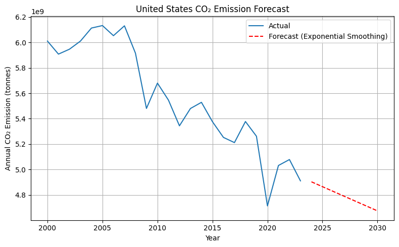

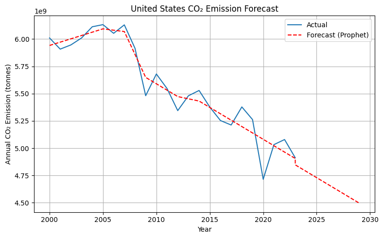
---

**China**

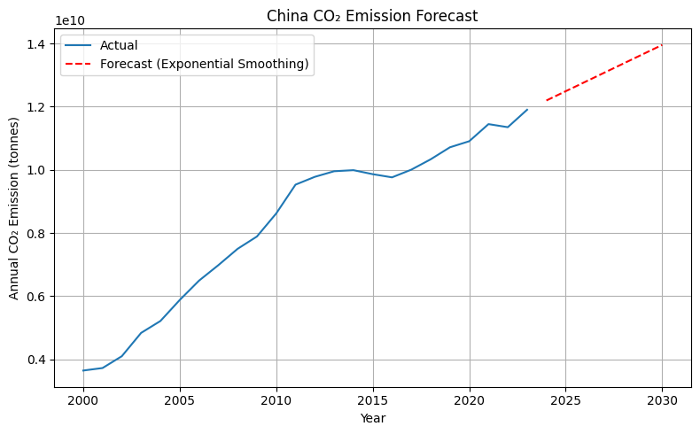

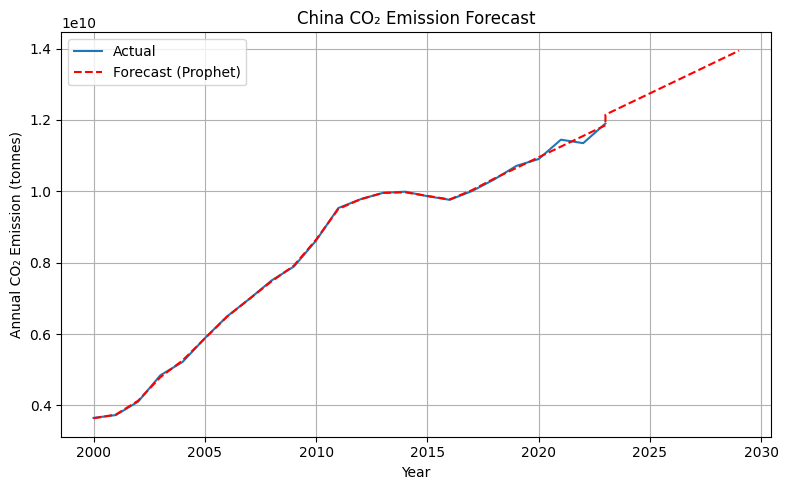
---

**India**

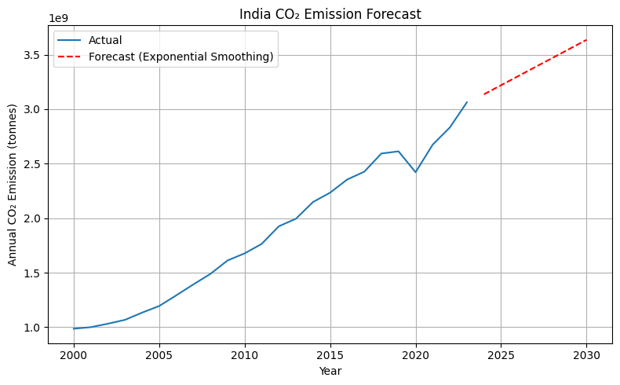

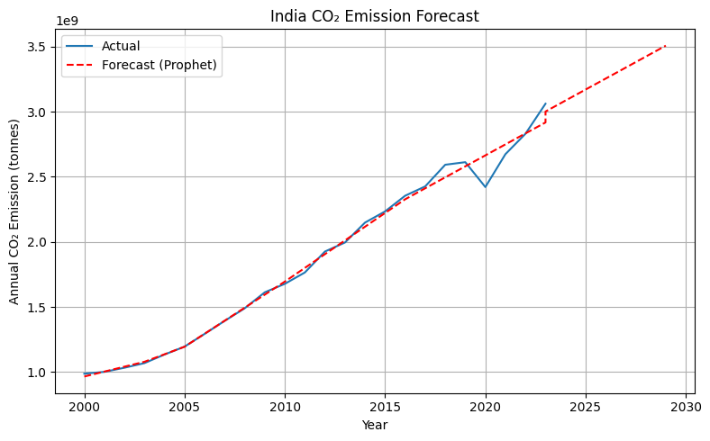
---

**Iran**

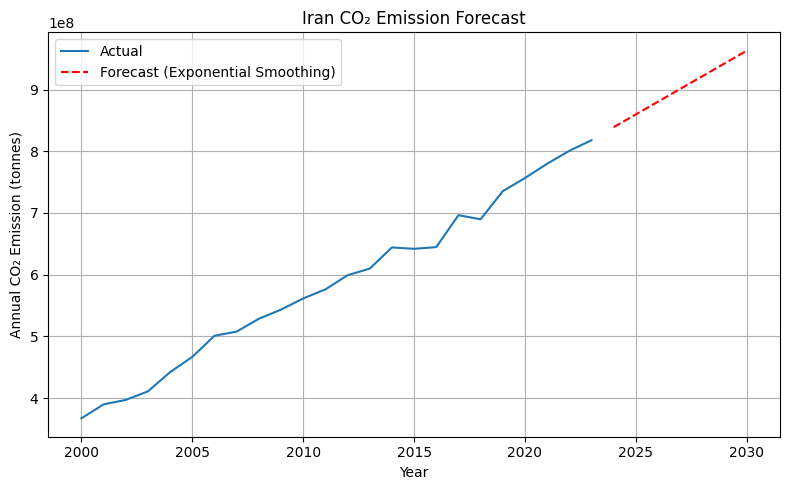

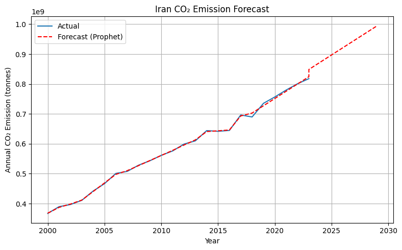
---

**Brazil**

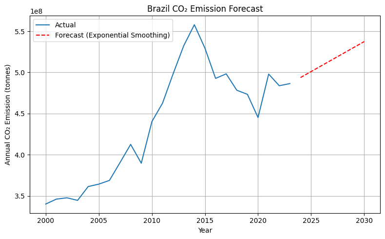

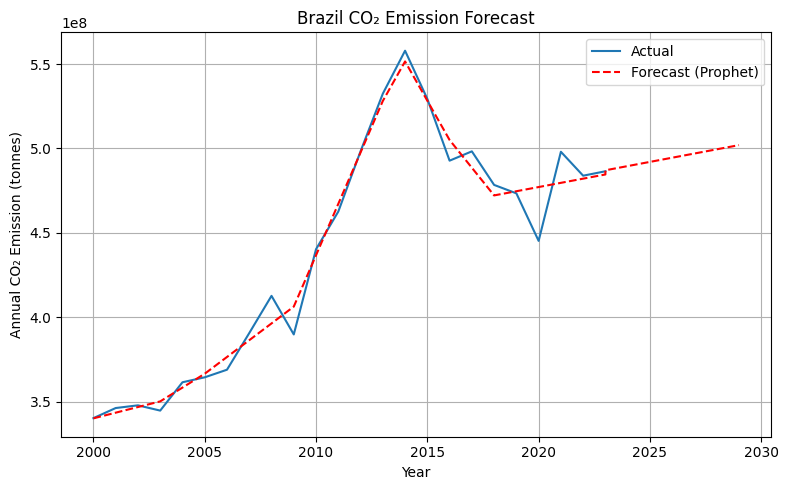
---

**United Kingdom**

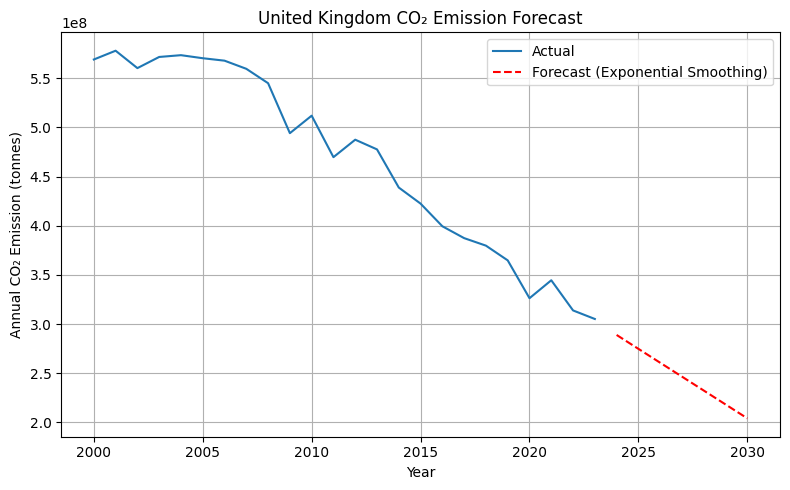

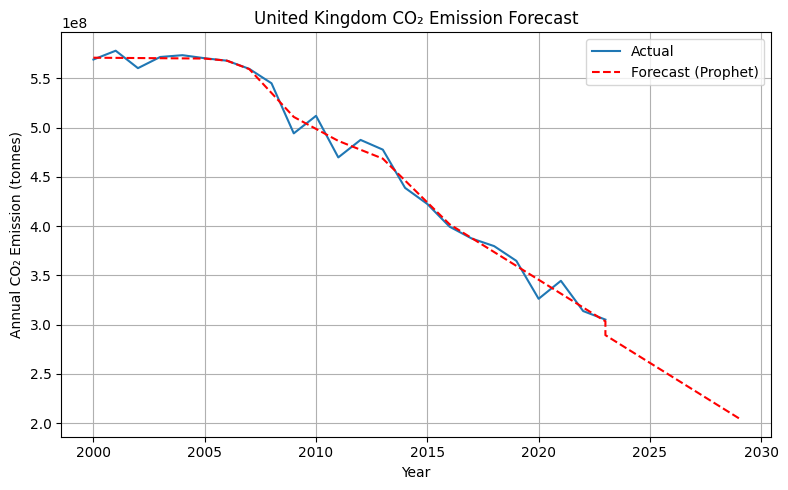
---


## 🛠️ Tech Stack

* **Python**
* Libraries: `pandas`, `numpy`, `matplotlib`, `statsmodels`, `prophet`

---

## 🚀 Getting Started

```bash
# 1. Clone the repository
git clone https://github.com/ItsJoelly/CO2-Emissions-Analysis-Forecasting
cd CO2-Emissions-Forecasting

# 2. Install required packages
pip install -r requirements.txt

# 3. Launch the Jupyter Notebook
jupyter notebook
```

---

## 📜 License

This project is under the MIT License.

---


